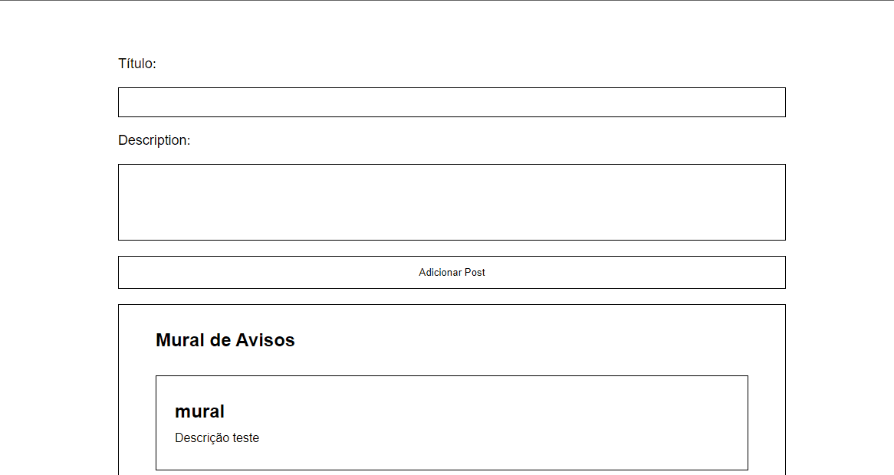

<h1 align="center">Mural de Avisos</h1>
<p align="center">🚀 Aplicação feita pra simular um mural de avisos </p>

<div align="center">
  
  
  
  
</div>

<p align="center">
 <a href="#objetivo">Objetivo</a> •
 <a href="#funcionalidades">Funcionalidades</a> • 
 <a href="#pre-req">Pré-requisitos</a> • 
 <a href="#tecnologias">Tecnologias</a> • 
 <a href="#autor">Autor</a> • 
 <a href="#license">License</a>
</p>
<h4 align="center"> 
	🚧  Mural de Avisos 📝 Concluído.  🚧
</h4>


<h1 id="objetivo">Objetivo 🎯</h1>
Montar um aplicação que tenha Front e o Back simples, para praticar os conceitos de requisições HTTP.

<h1 id="funcionalidades">Funcionalidades</h1>

- [x] Inputs onde o usuário possa escrever as informações do avisos
    - [x] Ao clicar no botão de "adicionar posts", pegar essas informações
    - [x] Fazer uma requisição POST com esses dados
    - [x] Pegar os dados do body no back e adicionar no array de avisos
- [x] Fazer uma requisição GET que retorne em json o array de avisos e 
      mostrar no front para o usuário

<div align="center">
  
</div>


<h1 id="pre-req">Pré-requisitos</h1>

Antes de começar, você vai precisar ter instalado em sua máquina o
[Git](https://git-scm.com) e o [NodeJS](https://nodejs.org/en/). Além disto é bom ter um editor para trabalhar com o código como [VSCode](https://code.visualstudio.com/)

💡O Frontend necessita que o Backend esteja sendo executado para funcionar.

### 🎲 Rodando o Front

```bash
# Clone este repositório
$ git clone <https://github.com/davivsouza/mural-avisos-front.git>

# Acesse a pasta do projeto no terminal/cmd
$ cd mural-avisos-front

# Instale as dependências
$ npm install

# Execute a aplicação em modo de desenvolvimento
$ npm run dev

# O localhost inciará na porta:3000 - acesse <http://localhost:3000>
```

### 🎲 Rodando o servidor (Back-end)
```bash
# Clone este repositório
$ git clone <https://github.com/davivsouza/mural-avisos-back.git>

# Acesse a pasta do projeto no terminal/cmd
$ cd mural-avisos-back

# Instale as dependências
$ npm install

# Execute a aplicação em modo de desenvolvimento
$ npm run dev

# O localhost inciará na porta:3333 - acesse <http://localhost:3333>
```

<h1 id="tecnologias">🛠 Tecnologias</h1>

### Front-end:
- [React](https://pt-br.reactjs.org/)
- [TypeScript](https://www.typescriptlang.org/)
- [Styled-components](https://styled-components.com/docs)
- [Axios](https://github.com/axios/axios)
### Back-end:
- [NodeJS](https://nodejs.org/en/)
- [TypeScript](https://www.typescriptlang.org/)
- [ts-node-dev](https://www.npmjs.com/package/ts-node-dev)
- [Express](https://expressjs.com/)
- [Cors](https://expressjs.com/en/resources/middleware/cors.html)

<h1 id="autor">Autor</h1>

<a href="https://github.com/davivsouza/">
 
 <br />
 <sub><b>Davi Souza</b></sub></a> <a href="https://github.com/davivsouza/" title="Davi V. Souza">🕊</a>


Feito com ❤️ por Davi V. Souza 👋🏽 Entre em contato!

[](https://www.linkedin.com/in/davi-vasconcelos-souza-236170234/) 
[](mailto:davivasconcelossouza21@gmail.com)


<h1 id="license">License</h1>
<p>MIT</p>
